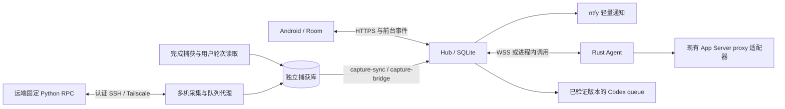

# ThreadBridge 架构入口

[产品约束](产品约束.md)定义预期行为。本文描述当前源码结构，模块文档定义具体合同。旧原型和逐轮部署记录不属于公开接入合同。

## 模块与数据流

| 模块 | 实现位置 | 权威合同 |
|---|---|---|
| M01 Android | `android/app/src/` | [Android 客户端](modules/Android客户端.md) |
| M02 Hub | `crates/threadbridge/src/hub.rs`、`store.rs` | [通信与存储](modules/通信与存储.md) |
| M03 Agent | `crates/threadbridge/src/agent.rs` | 持久发送意图，主动 WSS 或合并运行 |
| M04 Adapter / Capture | `adapter.rs`、`probe.rs`、`capture.rs`、`queue.rs`、`scripts/capture_*.py` | [Codex 接入](modules/Codex接入.md) |
| M05 Protocol | `crates/threadbridge/src/model.rs` | 版本 1，身份和大小白名单 |
| M06 Notification | `crates/threadbridge/src/notify.rs` | 持久 outbox、有效期和有界重试 |
| M07 Operations | `main.rs`、`scripts/`、`deploy/` | [运行与安装](运行与安装.md)、[多机接入](多机接入.md) |

Hub 的命令账本、事件游标和通知 outbox 使用 SQLite WAL/FULL；手机 Room 为离线 UI 数据源；原 Codex 对话是原始正文和轮次的来源，ThreadBridge 只持有副本。原生身份结合 host/profile/thread 派生业务键，标题不参与路由。

正式 proxy Adapter 仅附着已有服务。默认手机续聊可走经过版本验证的桌面 queue；队列入列不等于开始执行。独立 `resume_dispatch.py` 是有租约和权限约束的候选入口，不能以手机普通配对自动获得执行许可。

## 跨模块约束

- 手机、Agent 角色和凭证分离；Agent 只能更新自身主机的对话与回执。
- 持久化成功先于确认接收；副作用意图先于上游发送。恢复只重放已有回执，unknown 不重新执行。
- 完成捕获独立于 Codex 运行；正文只在确定 final/completed 后保存。用户消息读取绑定当前 thread/turn。
- collection 策略和删除 tombstone 阻止旧副本重新进入；手机 generation 切换保留配对并清除旧缓存。
- 正文、网络帧、缓存、事件、队列及 SQLite 规模有界；超限明确失败。
- Linux 服务与远端采集由原生服务管理器管理；脚本目录是通知配置和已部署服务的稳定入口。

## 验证关口

observed：源码包含四机运维、完成回复独立落盘、用户消息同步、桌面队列和 Android 客户端。已有指定设备/对话的接入与续聊记录；它们属于具体环境，不证明任意版本、目标或长时间运行通过。

| 关口 | 自动检查 | 仍需实机证明 |
|---|---|---|
| G01 接入 | proxy fixture、原 ID mock resume、queue 路由与捕获关联 | 各版本兼容、上下文、执行归属及重启后的持续可用 |
| G02 可靠性 | 去重、终态单调、过期、崩溃、迟到回执、unknown 不重发 | 桌面并发与真实副作用边界 |
| G03 有界服务 | 页/帧/缓存上限、采集与 RPC 边界 | 四主机压力、磁盘满、持续资源曲线 |
| G04 Android | JVM、Lint、debug/release、签名与升级身份检查 | 真机扫码、键盘、手势、升级和日常使用 |
| G05 公网通知 | HTTPS 配置、outbox 重试、深链接 | TLS 信任边界、移动网络和锁屏 p95 |
| G06 恢复 | WAL 一致性备份、只读恢复、撤销与重启测试 | 实际部署恢复、开机恢复及 24–72 小时运行 |

构建和集成顺序为 Rust 单元/Clippy → release → Python 单元与回环集成 → Android JVM/Lint/构建 → 原签名升级校验 → 经明确配置的实机验收。模块合同与 schema 变更须同步维护当前文档；共享协议、锁文件和数据库迁移统一集成。
